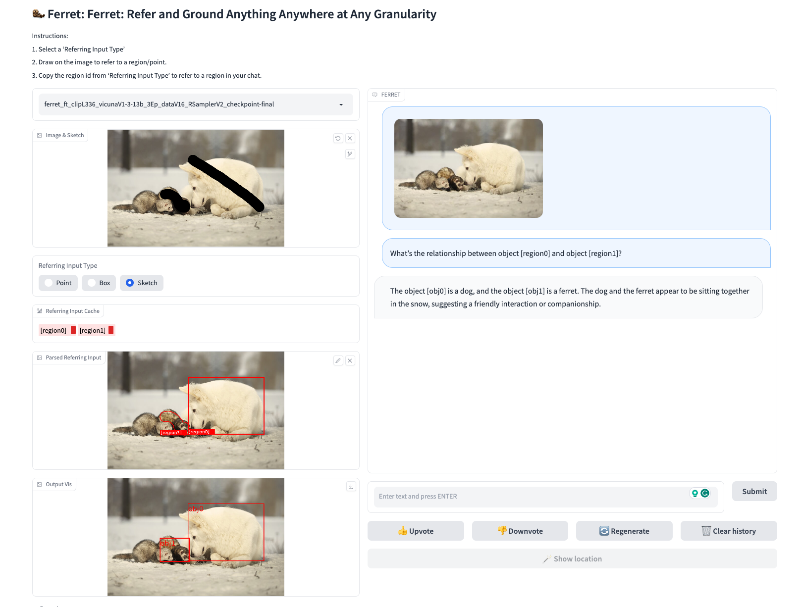

#  Ferret: Refer and Ground Anything Anywhere at Any Granularity

*An End-to-End MLLM that Accept Any-Form Referring and Ground Anything in Response.* [[Paper](https://arxiv.org/abs/2310.07704)]

## Contents
- [Setup](#setup)
- [Finetune](#finetune)
- [Demo](#demo)

## Setup

***Setting Up The RunPod Environment***

1. Basic Installations
```bash
apt-get update
apt-get install zip unzip
apt-get install git-lfs
git lfs install
```

2. Clone this repository and navigate to FERRET folder
```bash
git clone https://github.com/abdur75648/ferret-superagi
cd ferret-superagi
```

2. Install Packages
```Shell
pip install --upgrade pip
pip install -e .
pip install pycocotools
pip install protobuf==3.20.0
```

3. Install additional packages for training cases
```
pip install ninja
pip install tensorboard
pip install flash-attn==1.0.7 --no-build-isolation
```

## Finetune

1. Download and prepare pre-trained checkpoints
```Shell
cd ferret/model/
git clone https://huggingface.co/lmsys/vicuna-13b-v1.3
cd vicuna-13b-v1.3 && git lfs pull && cd ..
git clone https://huggingface.co/liuhaotian/llava-336px-pretrain-vicuna-13b-v1.3
cd llava-336px-pretrain-vicuna-13b-v1.3 && git lfs pull && cd ..
wget https://docs-assets.developer.apple.com/ml-research/models/ferret/ferret-13b/ferret-13b-delta.zip
unzip ferret-13b-delta.zip
cd ..
python3 -m ferret.model.apply_delta --base ./model/vicuna-13b-v1.3 --target ./model/ferret-13b-v1-3 --delta ./model/ferret-13b-delta
cd ..
```

2. Download and prepare data
* Put `supgeragi2k_annotations.json` in `dataset/` folder
    * Can download sample json `llava_instruct_complex_reasoning_77k.json` from [here](https://huggingface.co/datasets/liuhaotian/LLaVA-Instruct-150K)
* Put `supgeragi2k_images` in `dataset/` folder
    * Can download sample coco-2014 images for above sample json from [here](http://images.cocodataset.org/zips/train2014.zip)
    * Run `filter_coco.py` to filter images from coco-2014

3. Run the fine-tuning script
```bash
bash finetune_13b.sh
```

## Demo

To run our demo, you need to train FERRET and use the checkpoints locally. Gradio web UI is used. Please run the following commands one by one. 

#### Launch a controller
```Shell
python -m ferret.serve.controller --host 0.0.0.0 --port 10000
```

#### Launch a gradio web server.
```Shell
python -m ferret.serve.gradio_web_server --controller http://localhost:10000 --model-list-mode reload --add_region_feature
```

#### Launch a model worker

This is the worker that load the ckpt and do the inference on the GPU.  Each worker is responsible for a single model specified in `--model-path`.

```Shell
CUDA_VISIBLE_DEVICES=0 python -m ferret.serve.model_worker --host 0.0.0.0 --controller http://localhost:10000 --port 40000 --worker http://localhost:40000 --model-path ./checkpoints/ferret_13b --add_region_feature
```
Wait until the process finishes loading the model and you see "Uvicorn running on ...".  Now, refresh your Gradio web UI, and you will see the model you just launched in the model list.


<p align="center">
    </a> <br>
    Example of Ferret Interactive Demo.
</p>


## Reference
Original code: [LLaVA](https://github.com/apple/ml-ferret)

```bibtex
@article{you2023ferret,
  title={Ferret: Refer and Ground Anything Anywhere at Any Granularity},
  author={You, Haoxuan and Zhang, Haotian and Gan, Zhe and Du, Xianzhi and Zhang, Bowen and Wang, Zirui and Cao, Liangliang and Chang, Shih-Fu and Yang, Yinfei},
  journal={arXiv preprint arXiv:2310.07704},
  year={2023}
}
```

## Acknowledgement

- [LLaVA](https://github.com/haotian-liu/LLaVA): the codebase we built upon. 
- [Vicuna](https://github.com/lm-sys/FastChat): the LLM codebase.
